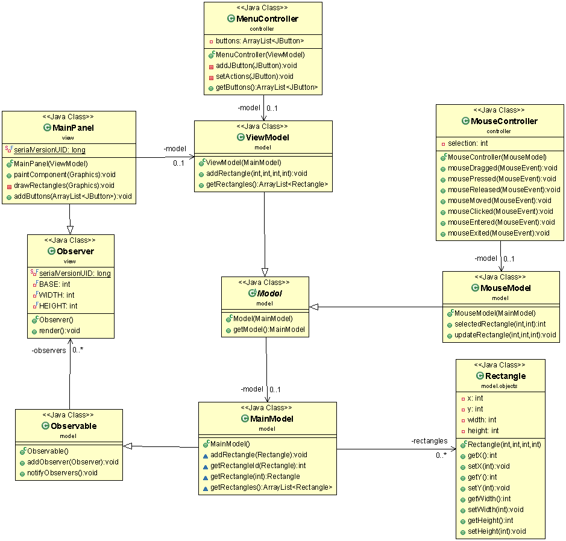

# OOP Model Viewer Controller

## Class Diagram
NOTE :: the class diagram is not updated to the latest commit!

A small application made to demonstrate how you can make scallable mvc demo without a log of code.

## Instructions
* After initialising the application calling `Main.java`, make a random click on the focused Java application.
  ** The click will spawn a rectangle with hardcoded attibutes to the top-left corner of the application.
* Click and drag while having your cursor in the area of the rectangle.
* Enjoy!

